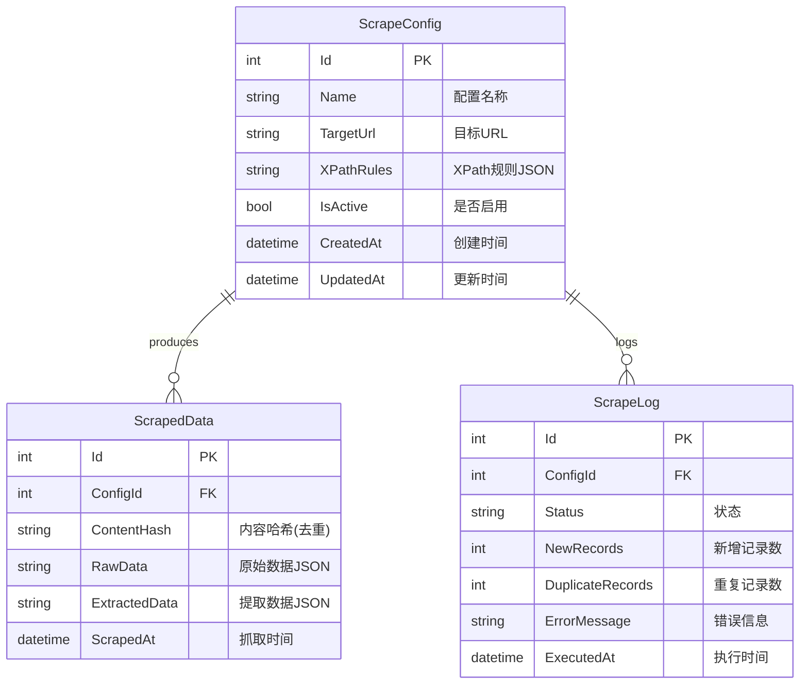

# Web Scraper 通用框架 - 项目设计文档

## 1. 系统架构

```mermaid
flowchart TD
    subgraph API["Mini API Layer"]
        A1[GET /api/configs]
        A2[POST /api/configs]
        A3[DELETE /api/configs/{id}]
        A4[POST /api/scrape/{configId}]
        A5[POST /api/scrape/all]
        A6[GET /api/data]
        A7[GET /api/data/{configId}]
    end

    subgraph Services["Core Services"]
        S1[ScraperService]
        S2[DataService]
    end

    subgraph Data["Data Layer"]
        D1[(SQLite Database)]
    end

    subgraph External["External"]
        E1[Target Websites]
    end

    A1 --> D1
    A2 --> D1
    A3 --> D1
    A4 --> S1
    A5 --> S1
    A6 --> D1
    A7 --> D1

    S1 --> E1
    S1 --> S2
    S2 --> D1
```

## 2. 数据库 ER 图



## 3. API 接口清单

| Method | Endpoint                 | Description                |
| ------ | ------------------------ | -------------------------- |
| GET    | `/api/configs`           | 获取所有抓取配置           |
| GET    | `/api/configs/{id}`      | 获取单个配置详情           |
| POST   | `/api/configs`           | 创建新的抓取配置           |
| PUT    | `/api/configs/{id}`      | 更新抓取配置               |
| DELETE | `/api/configs/{id}`      | 删除抓取配置               |
| POST   | `/api/scrape/{configId}` | 执行指定配置的抓取任务     |
| POST   | `/api/scrape/all`        | 执行所有启用配置的抓取任务 |
| GET    | `/api/data`              | 获取所有抓取数据（分页）   |
| GET    | `/api/data/{configId}`   | 获取指定配置的抓取数据     |
| GET    | `/api/logs`              | 获取抓取日志               |
| GET    | `/health`                | 健康检查                   |

## 4. 配置示例

### XPath 规则配置格式

```json
{
  "rules": [
    {
      "name": "title",
      "xpath": "//h1[@class='article-title']/text()",
      "type": "single"
    },
    {
      "name": "items",
      "xpath": "//div[@class='item']",
      "type": "list",
      "children": [
        {
          "name": "name",
          "xpath": ".//span[@class='name']/text()"
        },
        {
          "name": "price",
          "xpath": ".//span[@class='price']/text()"
        }
      ]
    }
  ]
}
```

## 5. 技术要点

### 5.1 去重策略

- 使用 SHA256 对提取的数据进行哈希
- 保存哈希值到 `ContentHash` 字段
- 插入前检查哈希是否已存在

### 5.2 错误处理

- 全局异常处理中间件
- 详细的错误日志记录
- API 统一响应格式

### 5.3 扩展性

- XPath 规则支持嵌套结构
- 支持单值和列表两种提取模式
- 配置化的请求头和超时设置
